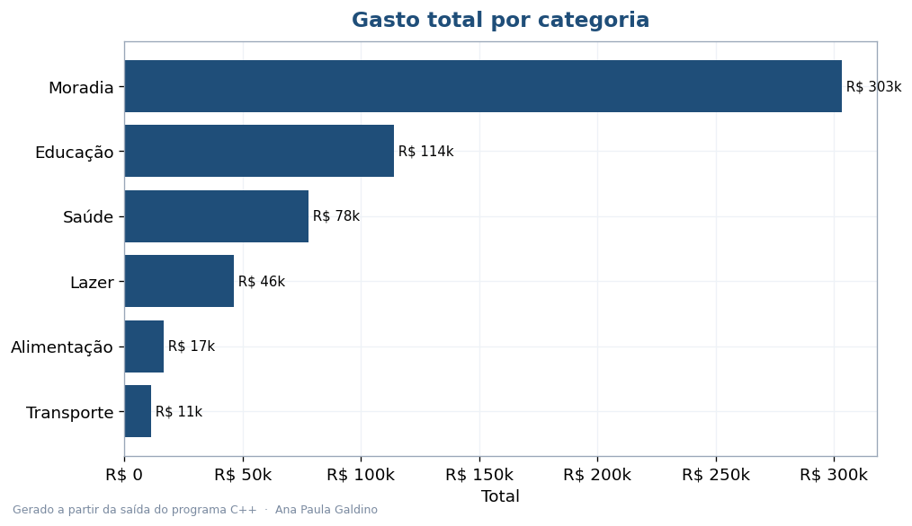
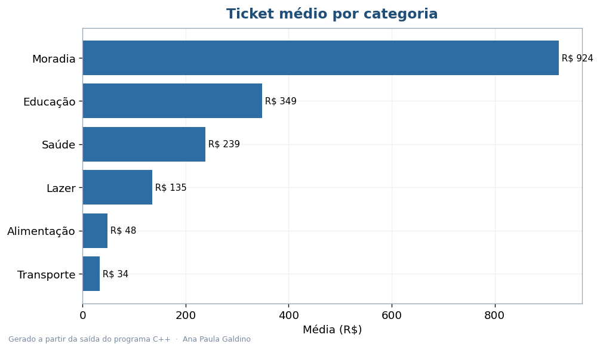
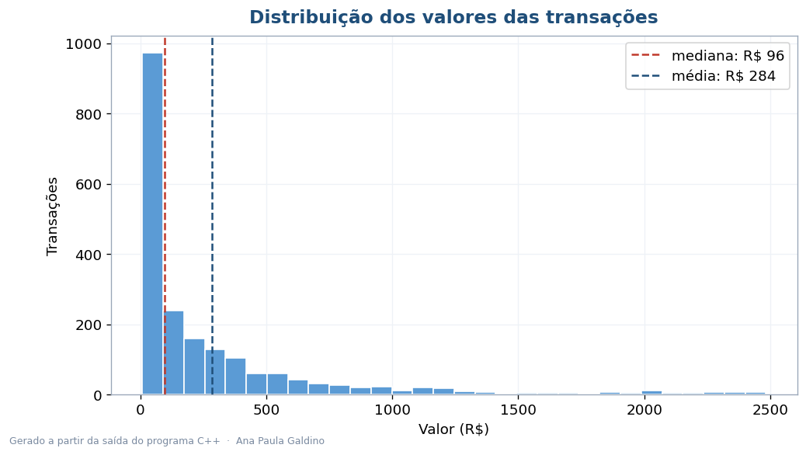
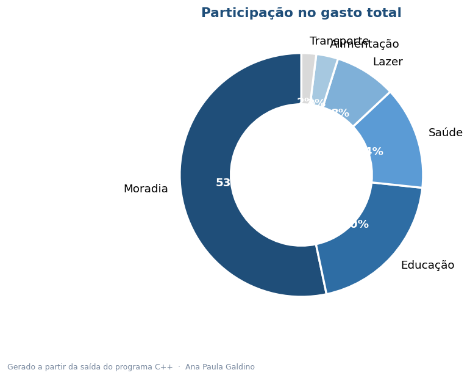

# Analisador Estatístico de Transações — C++

Ferramenta de linha de comando escrita em **C++** que lê um arquivo de transações e calcula
estatística descritiva — média, mediana, desvio padrão, mínimo, máximo — no geral e por
categoria, mais um histograma em ASCII. Incluí este projeto para mostrar que também trabalho
com uma linguagem **compilada e de baixo nível**, usando a STL.

**[Ler o relatório executivo (PDF)](Relatorio_Analise_Estatistica_Cpp.pdf)**

## Saída real do programa

```
==============================================
   ANALISE ESTATISTICA DE TRANSACOES
==============================================
Registros        : 2000
Soma total       : R$ 568509.70
Media            : R$ 284.25
Mediana          : R$ 96.36
Desvio padrao    : R$ 432.19
Minimo / Maximo  : R$ 8.01 / R$ 2483.28

Por categoria (n | media | total):
  Moradia         328 | R$   924.08 | R$   303096.65
  Educação        326 | R$   348.87 | R$   113732.22
  ...

Distribuicao dos valores (histograma):
         8 -      256 | ######################################## 1371
       256 -      503 | ######## 291
       ...
```

A diferença entre **média (R$ 284)** e **mediana (R$ 96)** revela uma distribuição
**assimétrica** — a maioria das transações é pequena, com uma cauda de valores altos.

## Visualizações (a partir da saída do programa)

| | |
|---|---|
|  |  |
|  |  |

## Estrutura

```
analisador-estatistico-cpp/
├── README.md
├── Relatorio_Analise_Estatistica_Cpp.pdf
├── dados/transacoes.csv
├── src/
│   ├── Estatisticas.hpp     # declarações das funções estatísticas
│   ├── Estatisticas.cpp     # implementação (sort, accumulate, etc.)
│   └── main.cpp             # leitura do CSV, relatório e histograma
├── saida/                   # resumo exportado pelo programa
└── imagens/                 # gráficos gerados a partir do resumo
```

## Como compilar e rodar

```bash
g++ -std=c++17 -O2 src/*.cpp -o analisador
./analisador                       # usa dados/transacoes.csv
./analisador caminho/para/outro.csv
```

## Destaques técnicos

- **STL:** `std::vector`, `std::map`, e algoritmos (`sort`, `accumulate`, `min/max_element`).
- **Separação de responsabilidades:** funções estatísticas em header + implementação próprios.
- **C++17**, compilado com `-O2`, sem bibliotecas externas.

---

Ana Paula Galdino · Análise e Desenvolvimento de Sistemas
[GitHub](https://github.com/AnaPaula-Galdino) · [LinkedIn](https://linkedin.com/in/galdinoana/)
